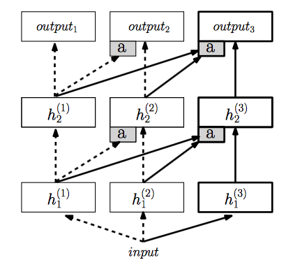
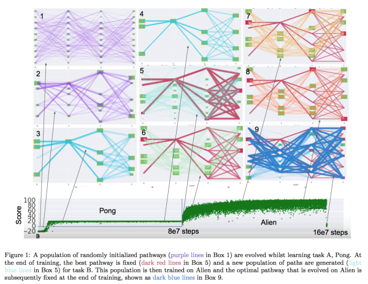

# Tranfer learning
## Recent 3 top papers
- [Progressive Neural Networks](https://arxiv.org/pdf/1606.04671.pdf)
- [PathNet: Evolution Channels Gradient Descent in Super Neural Networks](https://arxiv.org/pdf/1701.08734.pdf)
- [Overcoming catastrophic forgetting in neural networks](http://www.pnas.org/content/114/13/3521.full.pdf)
## Main Study
**举一反三**  
Human beings could use knowledge of one task to another task with faster learning pace and without catastrophic forgetting of first task.  
For instance, if we can play CS/CSGO (any FPS game), we could get used to playing PUBG faster and earlier.  
This is what we called continuous learning, or sequence learning, or transfer learning I think.  
The two main problems are how we use former knowledge (experience) and no forgetting former mission.
## Progressive NN
The method is straight and brute-force: reserve and fix former network, create a new network when facing with a new task.  
In order to make use of former experience, they use input of this task as input of all former networks, then combine output of former networks and current task network as input to next layer of current task network.

- If low level features are similar, current network may completely useless for that it only needs former networks' output
- Constrain: two task has similar low level features.
	- When low level is too different, using former network's output as input would not make any sense.
	- When current input can not be used in former networks, reusing higher-level network is a joke.

## PathNet
PathNet can be regarded as the generalization version of progressive NN.
  
Every layer of this network could be viewed as a block, so building a network is to build blocks and trying to reuse block. 
At first, we have N candidate blocks in every layer. For every potential network, each layer could use K blocks. We random a few networks (Path) to train some episodes. 
After training, we use genetic algorithm to eliminate bad paths and keep the good ones, and we mutate them, then continue to do training.  
Finally, we get a good path. From box 1 - box 4 
This is a independent algorithm for training a task.  
 
- How to extend to continuous learning? 
After training first task, we keep the parameters of path to first task all fixed, then re-initialize all other blocks, train them like usual. 
**The only difference is the some blocks are fixed** (red ones in graph). 
PathNet dont have the problems in Progressive NN.
### Abstract
- Area: artificial general intelligence (AGI)
- Neural network  parameter reuse without **catastrophic forgetting**!
- Reuse parameters in A and evolve a new path for B, which allows B to learn faster
- Support both supervised learning (MNIST, CIFAR, SVHN) and reinforcement learning (Atari, Labyrinth)
- Significant improvement on A3C (Asynchronous Advantage Actor-Critic)

## EWC
to do list